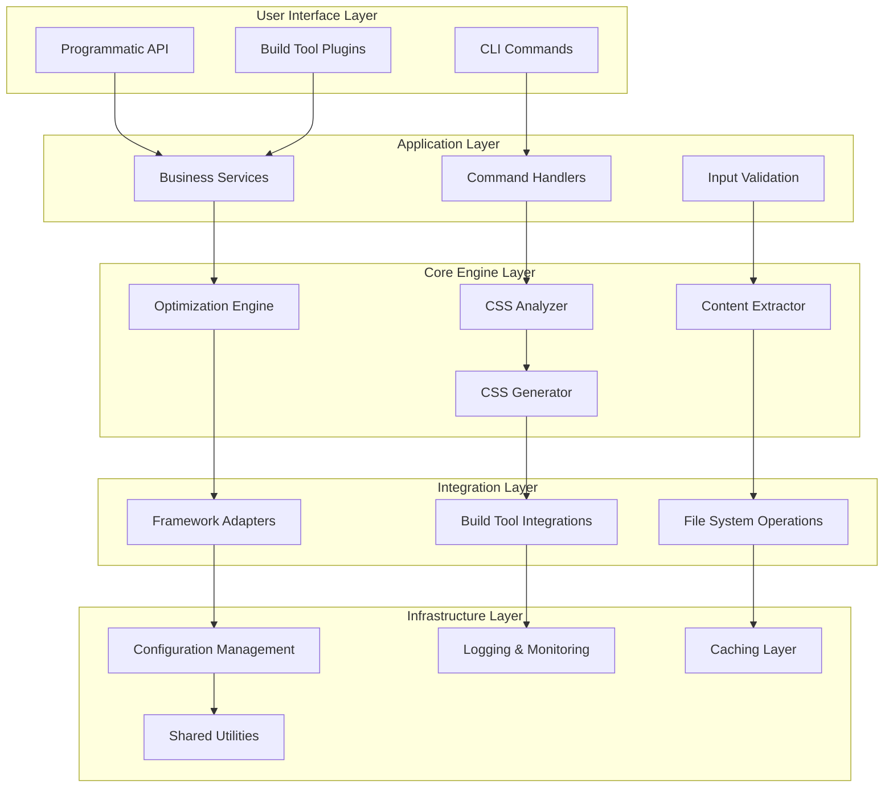
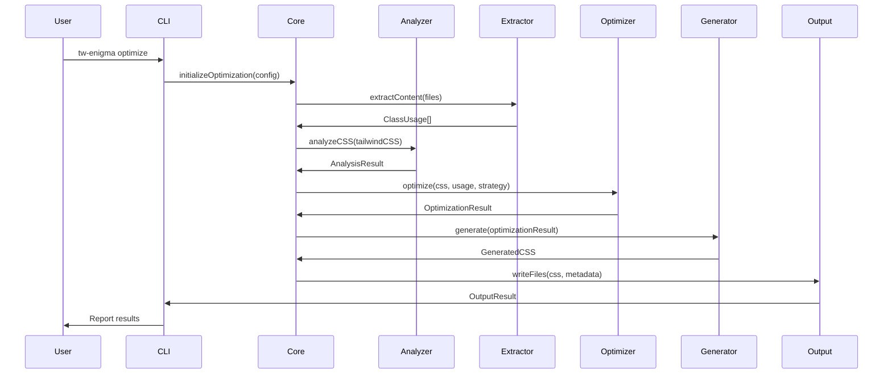
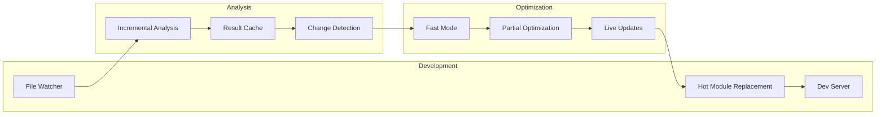
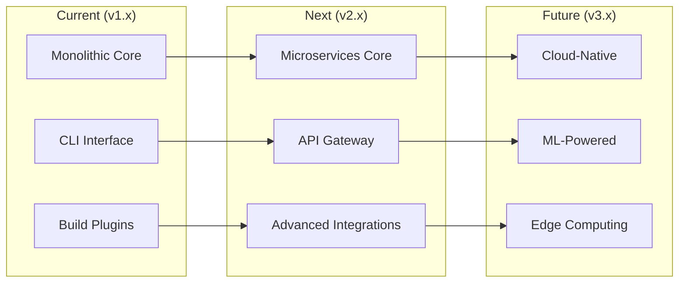

# tw-enigma Architecture Documentation

This document provides a comprehensive overview of the tw-enigma architecture, design decisions, and technical implementation details.

## 📋 Table of Contents

- [Overview](#overview)
- [System Architecture](#system-architecture)
- [Core Components](#core-components)
- [Package Structure](#package-structure)
- [Data Flow](#data-flow)
- [Design Decisions](#design-decisions)
- [Extension Points](#extension-points)
- [Performance Considerations](#performance-considerations)
- [Security Architecture](#security-architecture)
- [Testing Strategy](#testing-strategy)

## 🏗️ Overview

tw-enigma is an intelligent CSS optimization engine designed to dramatically reduce Tailwind CSS bundle sizes while maintaining functionality. The system uses a modular, extensible architecture that supports multiple optimization strategies and integrates seamlessly with modern build tools.

### Core Principles

1. **Modularity** - Loosely coupled components with clear interfaces
2. **Extensibility** - Plugin-based architecture for custom optimizations
3. **Performance** - Optimized for large-scale projects with parallel processing
4. **Developer Experience** - Rich tooling and debugging capabilities
5. **Framework Agnostic** - Works with any framework or vanilla JavaScript

### High-Level Goals

- **90%+ CSS Reduction** - Achieve dramatic bundle size reductions
- **Sub-second Analysis** - Fast optimization for development workflows
- **Zero Configuration** - Works out-of-the-box with sensible defaults
- **Framework Integration** - Seamless integration with popular build tools
- **Developer Tooling** - Rich debugging and analysis capabilities

## 🏗️ System Architecture

### Monorepo Structure

```
tw-enigma/
├── packages/
│   ├── core/                 # Core optimization engine
│   │   ├── src/
│   │   │   ├── analyzer/     # CSS analysis and parsing
│   │   │   ├── optimizer/    # Optimization algorithms
│   │   │   ├── extractors/   # File content extraction
│   │   │   ├── generators/   # CSS generation and output
│   │   │   ├── integrations/ # Framework integrations
│   │   │   ├── utils/        # Shared utilities
│   │   │   └── types/        # TypeScript type definitions
│   │   └── dist/             # Compiled output
│   │
│   └── cli/                  # Command-line interface
│       ├── src/
│       │   ├── commands/     # CLI command implementations
│       │   ├── utils/        # CLI-specific utilities
│       │   └── bin/          # Executable entry points
│       └── dist/             # Compiled CLI output
│
├── docs/                     # Documentation
├── examples/                 # Usage examples and tutorials
├── tests/                    # Test suites
└── tools/                    # Development and build tools
```

### Architectural Layers



## 🔧 Core Components

### 1. CSS Analyzer

**Location**: `packages/core/src/analyzer/`

The CSS Analyzer is responsible for parsing, analyzing, and understanding CSS structures.

```typescript
// Core analyzer interface
interface CSSAnalyzer {
  analyze(css: string): AnalysisResult
  parseRules(css: string): CSSRule[]
  extractClasses(content: string): ClassUsage[]
  calculateMetrics(analysis: AnalysisResult): Metrics
}

// Implementation example
class TailwindAnalyzer implements CSSAnalyzer {
  private parser: CSSParser
  private classExtractor: ClassExtractor
  private metricsCalculator: MetricsCalculator

  analyze(css: string): AnalysisResult {
    const parsed = this.parser.parse(css)
    const rules = this.extractRules(parsed)
    const metrics = this.calculateMetrics({ rules })
    
    return {
      rules,
      metrics,
      suggestions: this.generateSuggestions(rules, metrics)
    }
  }
}
```

**Key Responsibilities:**
- Parse CSS using PostCSS AST
- Extract Tailwind class usage patterns
- Identify optimization opportunities
- Generate analysis reports and metrics
- Detect unused and redundant styles

**Design Decisions:**
- **PostCSS Integration**: Leverages PostCSS for robust CSS parsing
- **Plugin Architecture**: Extensible analyzer plugins for different CSS frameworks
- **Streaming Processing**: Handles large CSS files efficiently
- **Caching**: Results cached based on content hash for performance

### 2. Optimization Engine

**Location**: `packages/core/src/optimizer/`

The Optimization Engine implements various strategies to reduce CSS size while maintaining functionality.

```typescript
// Optimization strategy interface
interface OptimizationStrategy {
  name: string
  optimize(css: string, usage: ClassUsage[]): OptimizationResult
  getMetrics(): OptimizationMetrics
}

// Strategy implementations
class AtomicStrategy implements OptimizationStrategy {
  optimize(css: string, usage: ClassUsage[]): OptimizationResult {
    // Generate minimal atomic CSS containing only used classes
    const usedClasses = this.extractUsedClasses(usage)
    const optimizedCSS = this.generateAtomicCSS(usedClasses)
    
    return {
      css: optimizedCSS,
      reduction: this.calculateReduction(css, optimizedCSS),
      metrics: this.getMetrics()
    }
  }
}

class HybridStrategy implements OptimizationStrategy {
  private atomicStrategy: AtomicStrategy
  private chunkedStrategy: ChunkedStrategy

  optimize(css: string, usage: ClassUsage[]): OptimizationResult {
    // Combine atomic and chunked strategies for optimal results
    const frequentClasses = this.identifyFrequentClasses(usage)
    const rareClasses = usage.filter(c => !frequentClasses.includes(c))
    
    const atomicResult = this.atomicStrategy.optimize(css, frequentClasses)
    const chunkedResult = this.chunkedStrategy.optimize(css, rareClasses)
    
    return this.combineResults(atomicResult, chunkedResult)
  }
}
```

**Optimization Strategies:**

1. **Atomic Strategy**
   - Generates minimal CSS with only used classes
   - Best for applications with low class reuse
   - Highest compression ratio

2. **Chunked Strategy**
   - Groups related classes into logical chunks
   - Better for component-based architectures
   - Balances size and maintainability

3. **Hybrid Strategy**
   - Combines atomic and chunked approaches
   - Adapts strategy based on usage patterns
   - Optimal for most real-world applications

**Design Decisions:**
- **Strategy Pattern**: Pluggable optimization strategies
- **Metrics-Driven**: Decisions based on quantitative analysis
- **Incremental**: Support for incremental optimization
- **Reversible**: Maintains source maps for debugging

### 3. Content Extractor

**Location**: `packages/core/src/extractors/`

The Content Extractor identifies class usage across different file types and frameworks.

```typescript
// Extractor interface
interface ContentExtractor {
  supportedExtensions: string[]
  extract(content: string, filePath: string): ClassUsage[]
}

// Framework-specific extractors
class ReactExtractor implements ContentExtractor {
  supportedExtensions = ['.jsx', '.tsx']
  
  extract(content: string, filePath: string): ClassUsage[] {
    const ast = this.parseJSX(content)
    const classUsages: ClassUsage[] = []
    
    // Extract className props
    traverse(ast, {
      JSXAttribute: (node) => {
        if (this.isClassNameAttribute(node)) {
          const classes = this.extractClasses(node.value)
          classUsages.push(...classes.map(cls => ({
            className: cls,
            filePath,
            location: this.getLocation(node),
            context: 'jsx-attribute'
          })))
        }
      }
    })
    
    return classUsages
  }
}

class VueExtractor implements ContentExtractor {
  supportedExtensions = ['.vue']
  
  extract(content: string, filePath: string): ClassUsage[] {
    const { template, script, style } = this.parseSFC(content)
    const classUsages: ClassUsage[] = []
    
    // Extract from template
    if (template) {
      classUsages.push(...this.extractFromTemplate(template, filePath))
    }
    
    // Extract from script (computed classes, etc.)
    if (script) {
      classUsages.push(...this.extractFromScript(script, filePath))
    }
    
    return classUsages
  }
}
```

**Supported File Types:**
- **JavaScript/TypeScript**: `.js`, `.ts`, `.jsx`, `.tsx`
- **Vue Single File Components**: `.vue`
- **Svelte Components**: `.svelte`
- **HTML Templates**: `.html`, `.htm`
- **Template Languages**: `.ejs`, `.hbs`, `.twig`
- **Markdown with JSX**: `.mdx`

**Design Decisions:**
- **Framework-Agnostic Core**: Extensible architecture for any framework
- **AST-Based Extraction**: Reliable parsing using language-specific parsers
- **Context Preservation**: Maintains location and context information
- **Performance Optimized**: Parallel processing for large codebases

### 4. CSS Generator

**Location**: `packages/core/src/generators/`

The CSS Generator creates optimized CSS output based on analysis and optimization results.

```typescript
// Generator interface
interface CSSGenerator {
  generate(optimization: OptimizationResult): GeneratedCSS
  addSourceMaps(css: string, mappings: SourceMapping[]): string
  minify(css: string): string
}

// Implementation
class TailwindGenerator implements CSSGenerator {
  private minifier: CSSMinifier
  private sourceMapGenerator: SourceMapGenerator
  
  generate(optimization: OptimizationResult): GeneratedCSS {
    const { usedClasses, strategy } = optimization
    
    // Generate CSS based on strategy
    const css = this.generateCSS(usedClasses, strategy)
    
    // Add source maps for debugging
    const sourceMap = this.generateSourceMap(css, optimization.mappings)
    
    // Minify for production
    const minified = this.minifier.minify(css)
    
    return {
      css,
      minified,
      sourceMap,
      metadata: this.generateMetadata(optimization)
    }
  }
  
  private generateCSS(classes: ClassUsage[], strategy: string): string {
    switch (strategy) {
      case 'atomic':
        return this.generateAtomicCSS(classes)
      case 'chunked':
        return this.generateChunkedCSS(classes)
      case 'hybrid':
        return this.generateHybridCSS(classes)
      default:
        throw new Error(`Unknown strategy: ${strategy}`)
    }
  }
}
```

**Output Formats:**
- **Standard CSS**: Regular CSS files
- **CSS Modules**: Scoped CSS with module exports
- **CSS-in-JS**: JavaScript objects for runtime styling
- **Critical CSS**: Above-the-fold styles for performance
- **Component CSS**: Per-component style extraction

**Design Decisions:**
- **Source Map Support**: Full source map generation for debugging
- **Multiple Formats**: Support for various CSS output formats
- **Metadata Generation**: Rich metadata for analysis and tooling
- **Post-Processing**: Integration with PostCSS plugins

## 📊 Data Flow

### Optimization Pipeline



### Development Workflow



## 🎯 Design Decisions

### 1. Monorepo Architecture

**Decision**: Use a monorepo with separate packages for core and CLI.

**Rationale**:
- **Shared Dependencies**: Common utilities and types
- **Coordinated Releases**: Simplified versioning and publishing
- **Developer Experience**: Single repository for all components
- **Build Optimization**: Shared build tools and configurations

**Trade-offs**:
- ✅ Simplified dependency management
- ✅ Easier cross-package refactoring
- ❌ Larger repository size
- ❌ Potential for coupling between packages

### 2. PostCSS Integration

**Decision**: Use PostCSS as the primary CSS parsing engine.

**Rationale**:
- **Industry Standard**: Widely adopted in the ecosystem
- **Plugin Ecosystem**: Rich ecosystem of plugins
- **AST Manipulation**: Powerful AST-based transformations
- **Performance**: Optimized for large CSS files

**Trade-offs**:
- ✅ Robust and reliable parsing
- ✅ Extensive plugin ecosystem
- ✅ Good performance characteristics
- ❌ Additional dependency
- ❌ Learning curve for contributors

### 3. Strategy Pattern for Optimization

**Decision**: Implement multiple optimization strategies using the Strategy pattern.

**Rationale**:
- **Flexibility**: Different strategies for different use cases
- **Extensibility**: Easy to add new optimization approaches
- **A/B Testing**: Compare effectiveness of different strategies
- **User Choice**: Allow users to select optimal strategy

**Trade-offs**:
- ✅ Highly flexible and extensible
- ✅ Clear separation of concerns
- ✅ Easy to test and benchmark
- ❌ Additional complexity
- ❌ More code to maintain

### 4. TypeScript-First Development

**Decision**: Build everything in TypeScript with comprehensive type definitions.

**Rationale**:
- **Type Safety**: Catch errors at compile time
- **Developer Experience**: Rich IDE support and autocomplete
- **Documentation**: Types serve as living documentation
- **Refactoring**: Safe refactoring with type checking

**Trade-offs**:
- ✅ Better developer experience
- ✅ Fewer runtime errors
- ✅ Self-documenting code
- ❌ Additional build step
- ❌ Learning curve for some contributors

### 5. Parallel Processing

**Decision**: Implement parallel processing for file analysis and optimization.

**Rationale**:
- **Performance**: Leverage multi-core systems
- **Scalability**: Handle large projects efficiently
- **Responsiveness**: Maintain UI responsiveness
- **Resource Utilization**: Better use of available resources

**Trade-offs**:
- ✅ Significant performance improvements
- ✅ Better scalability for large projects
- ✅ Improved user experience
- ❌ Added complexity
- ❌ Debugging challenges

## 🔌 Extension Points

### 1. Custom Extractors

```typescript
// Implement custom content extractor
class CustomFrameworkExtractor implements ContentExtractor {
  supportedExtensions = ['.custom']
  
  extract(content: string, filePath: string): ClassUsage[] {
    // Custom extraction logic
    return []
  }
}

// Register with the system
extractor.register(new CustomFrameworkExtractor())
```

### 2. Optimization Plugins

```typescript
// Custom optimization plugin
class CustomOptimizerPlugin implements OptimizerPlugin {
  name = 'custom-optimizer'
  
  optimize(css: string, context: OptimizationContext): string {
    // Custom optimization logic
    return css
  }
}

// Register plugin
optimizer.addPlugin(new CustomOptimizerPlugin())
```

### 3. Output Formatters

```typescript
// Custom output formatter
class CustomFormatter implements OutputFormatter {
  format(css: string, metadata: Metadata): FormattedOutput {
    // Custom formatting logic
    return { css, metadata }
  }
}

// Register formatter
generator.addFormatter('custom', new CustomFormatter())
```

### 4. Build Tool Integrations

```typescript
// Custom build tool integration
class CustomBuildToolPlugin {
  apply(compiler: CustomCompiler) {
    compiler.hooks.compilation.tap('TwEnigma', (compilation) => {
      // Integration logic
    })
  }
}
```

## ⚡ Performance Considerations

### 1. Caching Strategy

```typescript
// Multi-level caching system
interface CacheManager {
  // Memory cache for frequently accessed data
  memory: LRUCache<string, any>
  
  // File system cache for persistent storage
  filesystem: FilesystemCache
  
  // Redis cache for distributed systems
  redis?: RedisCache
}

// Cache implementation
class TwEnigmaCacheManager implements CacheManager {
  memory = new LRUCache({ max: 1000, ttl: 1000 * 60 * 10 }) // 10 minutes
  filesystem = new FilesystemCache('.tw-enigma/cache')
  redis = process.env.REDIS_URL ? new RedisCache(process.env.REDIS_URL) : undefined
  
  async get<T>(key: string): Promise<T | null> {
    // Check memory first
    let result = this.memory.get(key)
    if (result) return result
    
    // Check filesystem
    result = await this.filesystem.get(key)
    if (result) {
      this.memory.set(key, result)
      return result
    }
    
    // Check Redis if available
    if (this.redis) {
      result = await this.redis.get(key)
      if (result) {
        this.memory.set(key, result)
        await this.filesystem.set(key, result)
        return result
      }
    }
    
    return null
  }
}
```

### 2. Incremental Processing

```typescript
// Incremental analysis for development
class IncrementalAnalyzer {
  private previousAnalysis: Map<string, AnalysisResult> = new Map()
  private dependencyGraph: DependencyGraph = new DependencyGraph()
  
  async analyzeIncremental(
    changedFiles: string[],
    allFiles: string[]
  ): Promise<AnalysisResult> {
    // Identify affected files based on dependency graph
    const affectedFiles = this.dependencyGraph.getAffectedFiles(changedFiles)
    
    // Only re-analyze affected files
    const partialResults = await Promise.all(
      affectedFiles.map(file => this.analyzeFile(file))
    )
    
    // Merge with previous results
    return this.mergeResults(partialResults, this.previousAnalysis)
  }
}
```

### 3. Memory Management

```typescript
// Memory-efficient processing for large projects
class StreamingProcessor {
  async processLargeFile(filePath: string): Promise<ClassUsage[]> {
    const stream = fs.createReadStream(filePath, { encoding: 'utf8' })
    const results: ClassUsage[] = []
    
    let buffer = ''
    for await (const chunk of stream) {
      buffer += chunk
      
      // Process complete lines
      const lines = buffer.split('\n')
      buffer = lines.pop() || '' // Keep incomplete line
      
      for (const line of lines) {
        const classes = this.extractClassesFromLine(line)
        results.push(...classes)
      }
      
      // Prevent memory buildup
      if (results.length > 10000) {
        await this.flushResults(results)
        results.length = 0
      }
    }
    
    return results
  }
}
```

### 4. Worker Pool Management

```typescript
// Worker pool for parallel processing
class WorkerPool {
  private workers: Worker[] = []
  private queue: Task[] = []
  private maxWorkers: number
  
  constructor(maxWorkers = os.cpus().length) {
    this.maxWorkers = maxWorkers
    this.initializeWorkers()
  }
  
  async execute<T>(task: Task): Promise<T> {
    return new Promise((resolve, reject) => {
      this.queue.push({
        ...task,
        resolve,
        reject
      })
      
      this.processQueue()
    })
  }
  
  private processQueue() {
    const availableWorker = this.workers.find(w => w.isIdle)
    const nextTask = this.queue.shift()
    
    if (availableWorker && nextTask) {
      availableWorker.execute(nextTask)
    }
  }
}
```

## 🔒 Security Architecture

### 1. Input Validation

```typescript
// Comprehensive input validation
class InputValidator {
  validateFilePath(filePath: string): boolean {
    // Prevent path traversal attacks
    const normalized = path.normalize(filePath)
    return !normalized.includes('..') && !path.isAbsolute(normalized)
  }
  
  validateCSS(css: string): boolean {
    // Prevent CSS injection attacks
    const suspiciousPatterns = [
      /javascript:/i,
      /data:.*script/i,
      /expression\(/i,
      /@import.*url\(/i
    ]
    
    return !suspiciousPatterns.some(pattern => pattern.test(css))
  }
  
  validateConfig(config: Configuration): boolean {
    // Validate configuration schema
    return this.schema.validate(config).error === undefined
  }
}
```

### 2. Safe File Operations

```typescript
// Secure file operations
class SecureFileSystem {
  private allowedDirectories: string[]
  
  constructor(allowedDirectories: string[]) {
    this.allowedDirectories = allowedDirectories.map(dir => path.resolve(dir))
  }
  
  async readFile(filePath: string): Promise<string> {
    const resolvedPath = path.resolve(filePath)
    
    // Check if path is within allowed directories
    const isAllowed = this.allowedDirectories.some(dir => 
      resolvedPath.startsWith(dir)
    )
    
    if (!isAllowed) {
      throw new Error(`Access denied: ${filePath}`)
    }
    
    return fs.readFile(resolvedPath, 'utf8')
  }
}
```

### 3. Configuration Security

```typescript
// Secure configuration handling
class SecureConfig {
  private config: Configuration
  
  load(configPath: string): Configuration {
    // Validate configuration file path
    if (!this.isValidConfigPath(configPath)) {
      throw new Error('Invalid configuration file path')
    }
    
    // Load and validate configuration
    const config = this.loadConfig(configPath)
    this.validateConfig(config)
    
    // Sanitize sensitive data
    return this.sanitizeConfig(config)
  }
  
  private sanitizeConfig(config: Configuration): Configuration {
    // Remove or mask sensitive information
    const sanitized = { ...config }
    
    if (sanitized.apiKeys) {
      sanitized.apiKeys = Object.keys(sanitized.apiKeys).reduce((acc, key) => {
        acc[key] = '***masked***'
        return acc
      }, {} as Record<string, string>)
    }
    
    return sanitized
  }
}
```

## 🧪 Testing Strategy

### 1. Unit Testing

```typescript
// Example unit test for optimizer
describe('AtomicStrategy', () => {
  let strategy: AtomicStrategy
  
  beforeEach(() => {
    strategy = new AtomicStrategy()
  })
  
  it('should generate minimal CSS for used classes', () => {
    const css = '.btn { @apply bg-blue-500 text-white; }'
    const usage = [
      { className: 'bg-blue-500', filePath: 'test.js', location: { line: 1, column: 1 } }
    ]
    
    const result = strategy.optimize(css, usage)
    
    expect(result.css).toContain('.bg-blue-500')
    expect(result.css).not.toContain('.text-white')
    expect(result.reduction).toBeGreaterThan(0)
  })
})
```

### 2. Integration Testing

```typescript
// Integration test for full optimization pipeline
describe('Optimization Pipeline', () => {
  it('should optimize real project', async () => {
    const project = await setupTestProject({
      files: {
        'src/components/Button.tsx': `
          export const Button = () => (
            <button className="bg-blue-500 text-white px-4 py-2">
              Click me
            </button>
          )
        `,
        'tailwind.css': '@tailwind base; @tailwind components; @tailwind utilities;'
      }
    })
    
    const result = await optimize({
      input: project.path,
      strategy: 'atomic'
    })
    
    expect(result.reduction).toBeGreaterThan(90)
    expect(result.css).toContain('.bg-blue-500')
    expect(result.css).toContain('.text-white')
    expect(result.css).toContain('.px-4')
    expect(result.css).toContain('.py-2')
  })
})
```

### 3. Performance Testing

```typescript
// Performance benchmarks
describe('Performance', () => {
  it('should optimize large project within time limit', async () => {
    const largeProject = await setupLargeProject({
      files: 1000,
      classesPerFile: 50
    })
    
    const startTime = Date.now()
    const result = await optimize({ input: largeProject.path })
    const duration = Date.now() - startTime
    
    expect(duration).toBeLessThan(30000) // 30 seconds max
    expect(result.reduction).toBeGreaterThan(80)
  })
})
```

### 4. Visual Regression Testing

```typescript
// Visual regression tests for development dashboard
describe('Development Dashboard', () => {
  it('should render optimization results correctly', async () => {
    const browser = await puppeteer.launch()
    const page = await browser.newPage()
    
    await page.goto('http://localhost:3001/dashboard')
    await page.waitForSelector('.optimization-results')
    
    const screenshot = await page.screenshot()
    expect(screenshot).toMatchSnapshot('dashboard-results.png')
    
    await browser.close()
  })
})
```

## 🚀 Future Architecture

### Planned Enhancements

1. **Distributed Processing**
   - Kubernetes-based worker pools
   - Cloud-native optimization services
   - Auto-scaling based on workload

2. **Machine Learning Integration**
   - Usage pattern prediction
   - Automatic strategy selection
   - Optimization effectiveness learning

3. **Real-time Optimization**
   - Edge-based optimization
   - CDN integration
   - Runtime adaptation

4. **Advanced Analytics**
   - Performance impact tracking
   - Cost-benefit analysis
   - User experience metrics

### Migration Path



---

This architecture documentation provides a comprehensive overview of tw-enigma's design and implementation. For specific implementation details, refer to the source code and inline documentation within each package. 