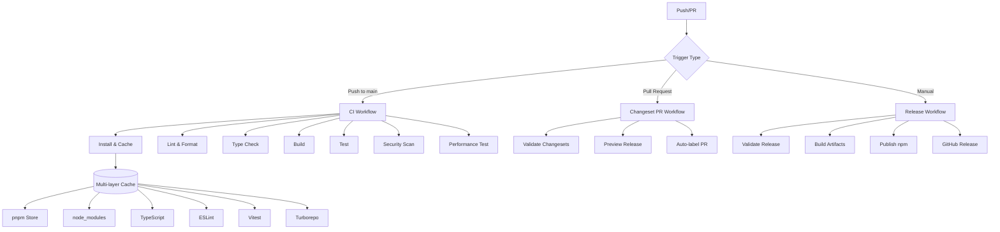

# CI/CD Pipeline Guide

Complete guide to the CI/CD infrastructure for the tw-enigma monorepo.

## 📋 Table of Contents

- [Overview](#overview)
- [Pipeline Architecture](#pipeline-architecture)
- [Workflows](#workflows)
- [Security Configuration](#security-configuration)
- [Performance Optimization](#performance-optimization)
- [Monitoring & Debugging](#monitoring--debugging)
- [Maintenance](#maintenance)
- [Troubleshooting](#troubleshooting)

## 🔄 Overview

Our CI/CD pipeline provides:

- **Automated Testing**: Multi-Node.js version testing with comprehensive coverage
- **Intelligent Caching**: Advanced multi-layered caching for 50%+ performance improvement
- **Release Automation**: Semantic versioning with changeset integration
- **Security Scanning**: Automated dependency audits and vulnerability checks
- **Performance Monitoring**: Benchmark tracking and regression detection
- **Artifact Management**: Build artifact caching and release asset generation

### Technology Stack

- **CI/CD Platform**: GitHub Actions
- **Package Manager**: pnpm with workspace support
- **Build System**: Turborepo with intelligent caching
- **Testing**: Vitest with coverage reporting
- **Release Management**: Changesets with semantic versioning
- **Security**: npm audit + GitHub security scanning

## 🏗️ Pipeline Architecture



## 🔧 Workflows

### 1. CI Workflow (`.github/workflows/ci.yml`)

**Trigger**: Push to any branch, Pull requests
**Purpose**: Comprehensive testing and validation

#### Jobs Overview

```yaml
install → lint, type-check, build → test, e2e → security → performance → validate
```

#### Key Features

- **Multi-Node.js Matrix**: Tests on Node.js 18.x and 20.x
- **Advanced Caching**: 6-layer caching strategy
- **Parallel Execution**: Jobs run concurrently where possible
- **Artifact Management**: Build artifacts cached and passed between jobs
- **Comprehensive Validation**: All aspects tested before merge

#### Performance Targets

- **Dependencies Cache Hit Rate**: 85%+
- **TypeScript Cache Hit Rate**: 70%+
- **ESLint Cache Hit Rate**: 80%+
- **Vitest Cache Hit Rate**: 75%+
- **Turborepo Cache Hit Rate**: 60%+
- **Overall CI Time Reduction**: 50%+

### 2. Changeset PR Workflow (`.github/workflows/changeset-pr.yml`)

**Trigger**: Pull request events (opened, synchronize, reopened, labeled)
**Purpose**: Changeset validation and release preview

#### Features

- **Changeset Validation**: Ensures proper format and content
- **Release Preview**: Shows version impact and changelog
- **Automatic Labeling**: Adds `release` label for PRs with changesets
- **Skip Option**: `skip-changeset` label for non-release changes
- **Smart Detection**: Identifies when changesets are required

### 3. Release Workflow (`.github/workflows/release.yml`)

**Trigger**: Push to main (with changesets), Manual dispatch
**Purpose**: Automated versioning, building, and publishing

#### Release Pipeline

1. **Validate**: Check changesets and package integrity
2. **Test**: Optional comprehensive testing (skip for emergencies)
3. **Build**: Create release artifacts and packages
4. **Release**: Version packages and publish to npm
5. **GitHub Release**: Create GitHub release with assets
6. **Post-Release**: Cleanup and notifications

#### Manual Release Options

- **Release Type**: auto, patch, minor, major
- **Skip Tests**: For emergency releases
- **Conditional Execution**: Smart job dependencies

## 🔐 Security Configuration

### Required Secrets

Configure in GitHub repository settings → Secrets and variables → Actions:

```bash
NPM_TOKEN          # npm registry authentication
GITHUB_TOKEN       # Automatically provided (repo access)
TURBO_TOKEN        # Optional: Turborepo remote caching
```

### Environment Variables

```bash
TURBO_TEAM         # Optional: Turborepo team name
PNPM_CACHE_FOLDER  # pnpm cache directory (.pnpm)
HUSKY              # Disabled in CI (0)
```

### Security Scanning

#### Dependency Audits

```yaml
- name: Run security audit
  run: pnpm audit --audit-level=moderate

- name: Check for vulnerabilities
  run: pnpm audit --audit-level=high --json | jq '.vulnerabilities | length'
```

#### License Compliance

```yaml
- name: Check licenses
  run: pnpm licenses list --prod --json
```

### Package Security

- **Public Access**: Packages published with `--access public`
- **Scope Protection**: `@tw-enigma` scope properly configured
- **Version Verification**: Check existing versions before publishing
- **Git Tag Verification**: Ensure proper tagging

## ⚡ Performance Optimization

### Caching Strategy

#### 1. pnpm Store Cache

```yaml
path: ${{ env.STORE_PATH }}
key: ${{ runner.os }}-pnpm-store-${{ steps.pnpm-version.outputs.version }}-${{ hashFiles('**/pnpm-lock.yaml') }}
```

#### 2. node_modules Cache

```yaml
path: |
  node_modules
  packages/*/node_modules
key: ${{ runner.os }}-node-modules-${{ needs.install.outputs.pnpm-version }}-${{ hashFiles('**/pnpm-lock.yaml') }}
```

#### 3. TypeScript Cache

```yaml
path: |
  packages/*/tsconfig.tsbuildinfo
  node_modules/.cache/typescript/**
key: ${{ runner.os }}-typescript-${{ hashFiles('**/tsconfig.json', 'config/tsconfig.base.json', 'packages/*/src/**/*.ts') }}
```

#### 4. ESLint Cache

```yaml
path: |
  node_modules/.cache/eslint/**
  .eslintcache
key: ${{ runner.os }}-eslint-${{ hashFiles('.eslintrc.js', '**/eslint.config.*', 'packages/*/src/**/*.ts') }}
```

#### 5. Vitest Cache

```yaml
path: |
  node_modules/.cache/vitest/**
  packages/*/node_modules/.cache/vitest/**
key: ${{ runner.os }}-vitest-${{ hashFiles('**/vitest.config.*', '**/vitest.workspace.*') }}
```

#### 6. Turborepo Cache

```yaml
path: .turbo
key: ${{ runner.os }}-turbo-${{ github.sha }}-${{ matrix.node-version }}
restore-keys: |
  ${{ runner.os }}-turbo-${{ github.ref_name }}-${{ matrix.node-version }}-
  ${{ runner.os }}-turbo-main-${{ matrix.node-version }}-
```

### Cache Configuration

See `.github/cache-config.json` for detailed cache settings:

- Compression algorithms (zstd, gzip)
- Cleanup policies and retention
- Performance monitoring
- Hit rate targets

### Optimization Techniques

- **fail-on-cache-miss**: Ensures dependent jobs have required caches
- **save-always**: Saves cache even on job failure
- **Smart Restore Keys**: Progressive fallback for cache misses
- **Parallel Cache Operations**: Multiple caches restored simultaneously

## 📊 Monitoring & Debugging

### CI Metrics Dashboard

Each workflow run includes metrics in job summaries:

```markdown
## 📊 CI Pipeline Cache Metrics

| Component    | Status | Cache Strategy               |
| ------------ | ------ | ---------------------------- |
| Dependencies | ✅     | pnpm store + node_modules    |
| TypeScript   | ✅     | tsbuildinfo + compiler cache |
| ESLint       | ✅     | eslint cache + results       |
| Vitest       | ✅     | test cache + results         |
| Turborepo    | ✅     | build cache + artifacts      |
```

### Performance Tracking

#### Build Time Monitoring

- **Target Build Time**: <2 minutes
- **Test Time**: <2 minutes unit tests, <5 minutes integration
- **Total CI Time**: <10 minutes for full pipeline

#### Cache Effectiveness

Monitor cache hit rates in action logs:

```bash
Cache restored from key: ubuntu-latest-pnpm-store-8-abc123...
Cache hit rate: 87% (target: 85%+)
```

### Debugging Tools

#### Verbose Logging

```bash
# Enable debug mode
ACTIONS_STEP_DEBUG=true

# Verbose npm/pnpm output
npm config set loglevel verbose
```

#### Cache Debugging

```bash
# List cache contents
pnpm store status

# Verify cache integrity
pnpm store verify
```

#### Workflow Debugging

```yaml
- name: Debug Environment
  run: |
    echo "Node.js version: $(node --version)"
    echo "pnpm version: $(pnpm --version)"
    echo "npm registry: $(npm config get registry)"
    echo "Working directory: $(pwd)"
    ls -la
```

## 🔧 Maintenance

### Regular Tasks

#### Weekly

- Review cache hit rates and performance metrics
- Check for security advisories and update dependencies
- Monitor npm package health and download statistics

#### Monthly

- Update GitHub Actions to latest versions
- Review and optimize cache strategies
- Audit CI/CD pipeline performance

#### Quarterly

- Review and update Node.js versions in matrix
- Evaluate new GitHub Actions features
- Performance benchmark review

### Cache Maintenance

#### Cache Cleanup

```bash
# Manual cache cleanup (if needed)
gh api \
  --method DELETE \
  -H "Accept: application/vnd.github+json" \
  /repos/OWNER/REPO/actions/caches/CACHE_ID
```

#### Cache Analytics

```bash
# List all caches
gh api \
  -H "Accept: application/vnd.github+json" \
  /repos/OWNER/REPO/actions/caches

# Cache usage statistics
gh api \
  -H "Accept: application/vnd.github+json" \
  /repos/OWNER/REPO/actions/cache/usage
```

### Dependency Updates

#### Automated Updates

- Dependabot configured for security updates
- Regular dependency review in PRs
- Changesets for dependency updates

#### Manual Updates

```bash
# Update all dependencies
pnpm update

# Update specific categories
pnpm update --depth 0  # Direct dependencies only
pnpm update --latest   # Latest versions
```

## 🐛 Troubleshooting

### Common Issues

#### Cache Misses

**Problem**: Low cache hit rates, slow CI times
**Solutions**:

1. Check cache key patterns for consistency
2. Verify file hash includes all relevant files
3. Review restore-keys for proper fallback
4. Monitor cache size and eviction policies

#### Build Failures

**Problem**: Inconsistent build failures
**Solutions**:

1. Check Node.js version compatibility
2. Verify dependency versions and lock file
3. Review environment variables and secrets
4. Check for race conditions in parallel jobs

#### Publication Failures

**Problem**: npm publish errors
**Solutions**:

1. Verify NPM_TOKEN has correct permissions
2. Check package version doesn't already exist
3. Review package.json configuration
4. Verify npm registry settings

#### Workflow Timeouts

**Problem**: Jobs timing out or hanging
**Solutions**:

1. Review resource usage and job complexity
2. Split large jobs into smaller units
3. Add timeout configurations
4. Monitor for infinite loops or blocking operations

### Debug Commands

#### CI Environment Debug

```bash
# Check environment
env | sort

# Verify installations
which node npm pnpm
node --version
npm --version
pnpm --version

# Check registry configuration
npm config list
pnpm config list
```

#### Package Debug

```bash
# Verify package structure
pnpm list --depth=0
pnpm why <package-name>

# Check build outputs
ls -la packages/*/dist/
```

#### Release Debug

```bash
# Check changeset status
pnpm changeset status

# Verify package versions
npm view @tw-enigma/core versions --json
npm view @tw-enigma/cli versions --json
```

### Emergency Procedures

#### Skip CI Checks

Add `[skip ci]` to commit message (use sparingly):

```bash
git commit -m "docs: update README [skip ci]"
```

#### Emergency Release

1. Use manual workflow dispatch
2. Select appropriate version bump
3. Enable "skip tests" if critical
4. Monitor release process closely

#### Rollback Release

```bash
# Deprecate problematic version
npm deprecate @tw-enigma/core@1.0.0 "Critical issue - use 1.0.1+"

# Emergency patch release
pnpm changeset add
# Select packages, patch version, describe fix
pnpm version && pnpm release
```

## 📚 Additional Resources

- [GitHub Actions Documentation](https://docs.github.com/en/actions)
- [pnpm Workspace Guide](https://pnpm.io/workspaces)
- [Turborepo Documentation](https://turbo.build/repo)
- [Changesets Documentation](https://github.com/changesets/changesets)
- [npm Publishing Guide](https://docs.npmjs.com/packages-and-modules/contributing-packages-to-the-registry)

## 🔗 Related Documentation

- [Changeset Workflow Guide](./CHANGESET_WORKFLOW.md)
- [Cache Optimization Guide](./CI_CACHE_OPTIMIZATION.md)
- [Turborepo Performance Guide](./TURBOREPO_PERFORMANCE.md)
- [Security Configuration](../README.md#security)

---

For CI/CD issues or questions, please open an issue with the `ci/cd` label.
