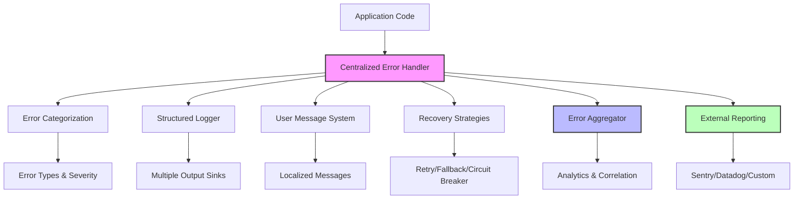

# TW-Enigma Error Handling and Logging System

## Table of Contents

1. [Overview](#overview)
2. [Architecture](#architecture)
3. [Error Categories and Severity](#error-categories-and-severity)
4. [Error Code Conventions](#error-code-conventions)
5. [Centralized Error Handling](#centralized-error-handling)
6. [Structured Logging](#structured-logging)
7. [User Message System](#user-message-system)
8. [Recovery Strategies](#recovery-strategies)
9. [Error Aggregation and Analytics](#error-aggregation-and-analytics)
10. [External Reporting](#external-reporting)
11. [Configuration](#configuration)
12. [Integration Guide](#integration-guide)
13. [Troubleshooting](#troubleshooting)
14. [Code Examples](#code-examples)

## Overview

The TW-Enigma Error Handling and Logging System provides a comprehensive, multi-layered approach to error management, logging, and recovery. The system is designed to:

- **Centralize** error handling across all components
- **Categorize** and **prioritize** errors for appropriate handling
- **Provide** actionable user-facing error messages
- **Implement** automatic recovery strategies
- **Aggregate** and **correlate** errors for analysis
- **Integrate** with external monitoring platforms
- **Support** both development and production environments

### Key Features

- ✅ **Centralized Error Management**: Single point of control for all error handling
- ✅ **Structured Logging**: Consistent, searchable, and analyzable log entries
- ✅ **User-Friendly Messages**: Contextual error messages with actionable guidance
- ✅ **Automatic Recovery**: Smart recovery strategies based on error type and context
- ✅ **Error Analytics**: Aggregation, correlation, and trend analysis
- ✅ **External Integration**: Support for Sentry, Datadog, LogRocket, and custom providers
- ✅ **Performance Monitoring**: Built-in metrics and performance tracking
- ✅ **Security Conscious**: Information filtering based on environment and sensitivity

## Architecture

The error handling system consists of several interconnected components:



### Core Components

| Component | Purpose | Location |
|-----------|---------|----------|
| **CentralizedErrorHandler** | Main orchestrator for all error handling | `src/errorHandler/centralized.ts` |
| **StructuredLogger** | Enhanced logging with multiple outputs | `src/utils/structuredLogger.ts` |
| **UserMessageSystem** | User-friendly error messages | `src/errorHandler/userMessageSystem.ts` |
| **RecoveryStrategies** | Automatic error recovery mechanisms | `src/errorHandler/recoveryStrategies.ts` |
| **ErrorAggregator** | Error analytics and correlation | `src/errorHandler/errorAggregator.ts` |
| **ExternalReporting** | Integration with monitoring platforms | `src/errorHandler/externalReporting.ts` |

## Error Categories and Severity

### Error Categories

Errors are classified into the following categories for appropriate handling:

```typescript
export enum ErrorCategory {
  /** Configuration-related errors */
  CONFIGURATION = 'configuration',
  
  /** Input validation errors */
  VALIDATION = 'validation',
  
  /** Programming logic errors */
  PROGRAMMING = 'programming',
  
  /** External service/API errors */
  EXTERNAL_SERVICE = 'external_service',
  
  /** System resource errors (memory, disk, etc.) */
  RESOURCE = 'resource',
  
  /** General operational errors */
  OPERATIONAL = 'operational'
}
```

### Error Severity Levels

```typescript
export enum ErrorSeverity {
  /** Low impact, informational */
  LOW = 1,
  
  /** Medium impact, may affect functionality */
  MEDIUM = 2,
  
  /** High impact, significant functionality affected */
  HIGH = 3,
  
  /** Critical impact, system stability at risk */
  CRITICAL = 4
}
```

### Category-Severity Matrix

| Category | Typical Severity | Recovery Strategy | User Impact |
|----------|------------------|-------------------|-------------|
| **Configuration** | Medium-High | User prompt, fallback | Manual intervention required |
| **Validation** | Low-Medium | Skip, retry with correction | Input guidance provided |
| **Programming** | High-Critical | Abort, report to developers | Feature unavailable |
| **External Service** | Medium-High | Retry, fallback, circuit breaker | Graceful degradation |
| **Resource** | Medium-Critical | Cleanup, graceful degradation | Performance impact |
| **Operational** | Low-High | Retry, skip, continue | Varies by context |

## Error Code Conventions

The system uses a hierarchical error code structure for consistent error identification and handling.

### Error Code Format

```
<NAMESPACE>-<CATEGORY>-<SEQUENCE>
```

**Examples:**
- `CORE-001`: Core configuration error
- `CLI-PARSE-001`: CLI parsing error  
- `FILE-READ-002`: File reading error
- `CSS-SYNTAX-001`: CSS syntax error

### Namespace Definitions

| Namespace | Purpose | Example Codes |
|-----------|---------|---------------|
| **CORE** | Core system errors | `CORE-001`, `CORE-002` |
| **CLI** | Command-line interface | `CLI-001`, `CLI-PARSE-001` |
| **FILE** | File operations | `FILE-001`, `FILE-READ-001` |
| **CSS** | CSS processing | `CSS-001`, `CSS-SYNTAX-001` |
| **PATTERN** | Pattern analysis | `PATTERN-001`, `PATTERN-FREQ-001` |
| **PERF** | Performance issues | `PERF-001`, `PERF-MEMORY-001` |
| **INTEGRATION** | Build tool integration | `INTEGRATION-001` |

### Adding New Error Codes

1. **Choose appropriate namespace** (or create new one)
2. **Select category** based on error type
3. **Assign sequential number** within namespace
4. **Register in UserMessageSystem** with appropriate messaging
5. **Document in error code registry**

## Centralized Error Handling

The `CentralizedErrorHandler` provides a unified interface for all error handling operations.

### Basic Usage

```typescript
import { initializeCentralizedErrorHandling, handleCentralizedError } from '@tw-enigma/core/errorHandler';

// Initialize the system
await initializeCentralizedErrorHandling({
  enablePrimaryFeatures: true,
  enableEnhancedFeatures: true,
  enableDetailedLogging: true,
  projectContext: {
    name: 'my-app',
    version: '1.0.0',
    environment: 'production'
  }
});

// Handle an error
try {
  // Some operation that might fail
  await processFiles();
} catch (error) {
  const recovered = await handleCentralizedError(error, {
    category: ErrorCategory.EXTERNAL_SERVICE,
    severity: ErrorSeverity.MEDIUM,
    operation: 'file-processing',
    metadata: { fileCount: 10 },
    attemptRecovery: true
  });
  
  if (!recovered) {
    // Handle unrecoverable error
    console.error('Operation failed and could not be recovered');
  }
}
```

### Configuration Options

```typescript
interface CentralizedErrorConfig {
  enablePrimaryFeatures: boolean;     // Circuit breaker, analytics
  enableEnhancedFeatures: boolean;    // Advanced recovery, context
  enableDetailedLogging: boolean;     // Verbose logging
  logger?: Logger;                    // Custom logger instance
  projectContext?: {                  // Project metadata
    name: string;
    version: string;
    environment: 'development' | 'production' | 'test';
  };
}
```

## Structured Logging

The structured logging system provides consistent, searchable log entries with multiple output formats and destinations.

### Features

- **Multiple Output Sinks**: Console, file, remote endpoints
- **Configurable Formats**: JSON, human-readable, CSV, syslog
- **Namespace Filtering**: Include/exclude specific error codes or namespaces
- **Performance Metrics**: Built-in timing and memory tracking
- **Context Propagation**: Correlation IDs and session tracking

### Usage Examples

```typescript
import { createStructuredLogger } from '@tw-enigma/core/utils';

const logger = createStructuredLogger({
  component: 'file-processor',
  level: LogLevel.INFO,
  sinks: [
    {
      name: 'console',
      enabled: true,
      minLevel: LogLevel.INFO,
      format: 'human',
      output: 'console',
      config: { colorize: true }
    },
    {
      name: 'file',
      enabled: true,
      minLevel: LogLevel.DEBUG,
      format: 'json',
      output: 'file',
      config: { filePath: './logs/app.log' }
    }
  ]
});

// Log with context and error code
await logger.error('File processing failed', {
  filePath: '/path/to/file.css',
  fileSize: 1024
}, {
  namespace: 'FILE',
  code: 'FILE-001',
  correlationId: 'req-123'
});
```

### Log Entry Structure

```typescript
interface StructuredLogEntry {
  id: string;                    // Unique log entry ID
  level: LogLevel;               // Log level
  message: string;               // Primary message
  timestamp: string;             // ISO timestamp
  component: string;             // Logger component
  namespace?: string;            // Error namespace
  code?: string;                 // Error code
  context: Record<string, any>;  // Structured context
  correlationId?: string;        // Request correlation
  sessionId?: string;            // Session tracking
  host: {                       // Host information
    hostname: string;
    pid: number;
  };
  metrics?: {                   // Performance metrics
    duration?: number;
    memory?: NodeJS.MemoryUsage;
  };
}
```

## User Message System

The user message system transforms internal error codes into user-friendly messages with actionable guidance.

### Features

- **Error Code Mapping**: Automatic mapping from error codes to user messages
- **Contextual Information**: Dynamic message interpolation with error context
- **Localization Support**: Multi-language message support
- **Security Filtering**: Information hiding based on environment
- **Recovery Guidance**: Actionable suggestions for error resolution

### Message Structure

```typescript
interface UserMessage {
  message: string;              // Primary user-facing message
  details?: string;             // Detailed explanation
  suggestions: string[];        // Actionable suggestions
  helpLinks?: string[];         // Documentation links
  requiresAttention: boolean;   // Immediate attention needed
  recoveryDifficulty: number;   // Recovery difficulty (1-5)
}
```

### Usage Example

```typescript
import { generateUserMessage } from '@tw-enigma/core/errorHandler';

try {
  await loadConfiguration();
} catch (error) {
  const userMessage = generateUserMessage(error, {
    filePath: './tw-enigma.config.js',
    operation: 'configuration-loading'
  });
  
  console.error(userMessage.message);
  console.log('Suggestions:');
  userMessage.suggestions.forEach(suggestion => {
    console.log(`  • ${suggestion}`);
  });
}
```

### Adding Custom Error Mappings

```typescript
import { getUserMessageSystem } from '@tw-enigma/core/errorHandler';

getUserMessageSystem().registerErrorMapping({
  code: 'CUSTOM-001',
  category: ErrorCategory.CONFIGURATION,
  severity: ErrorSeverity.MEDIUM,
  messageTemplate: 'Custom configuration error in {filePath}',
  detailTemplate: 'The custom configuration file contains invalid settings.',
  suggestions: [
    'Check the configuration file syntax',
    'Verify all required fields are present',
    'Consult the documentation for valid options'
  ],
  helpLinks: ['https://docs.example.com/configuration'],
  securityLevel: 'public'
});
```

## Recovery Strategies

The recovery system provides automatic error handling strategies based on error type and context.

### Available Strategies

1. **Retry**: Exponential backoff with jitter
2. **Fallback**: Switch to alternative implementation
3. **Circuit Breaker**: Prevent cascade failures
4. **User Prompt**: Interactive error resolution
5. **Graceful Degradation**: Continue with reduced functionality
6. **Skip**: Bypass non-critical operations
7. **Abort**: Stop operation entirely

### Strategy Selection

Strategies are automatically selected based on:
- **Error Category**: Type of error encountered
- **Error Severity**: Impact level of the error
- **Operation Context**: What was being attempted
- **Previous Attempts**: History of recovery attempts
- **System State**: Current system conditions

### Usage Example

```typescript
import { executeErrorRecovery } from '@tw-enigma/core/errorHandler';

try {
  await connectToService();
} catch (error) {
  const result = await executeErrorRecovery(error, 'service-connection', {
    serviceUrl: 'https://api.example.com',
    timeout: 5000
  });
  
  if (result.success) {
    console.log(`Recovered using strategy: ${result.strategy}`);
    // Continue with result.result
  } else {
    console.error('Recovery failed:', result.error);
  }
}
```

### Custom Recovery Strategies

```typescript
import { getRecoveryStrategies, RecoveryStrategyType } from '@tw-enigma/core/errorHandler';

getRecoveryStrategies().registerStrategy({
  type: 'custom_strategy' as RecoveryStrategyType,
  priority: 7,
  canHandle: (error, context) => {
    return error.message.includes('custom_error');
  },
  execute: async (context, config) => {
    // Custom recovery logic
    return {
      success: true,
      strategy: 'custom_strategy' as RecoveryStrategyType,
      result: { recovered: true },
      totalAttempts: 1,
      totalTime: 100,
      attempts: [],
      shouldContinue: true
    };
  }
});
```

## Error Aggregation and Analytics

The error aggregation system collects, groups, and analyzes errors for insights and alerting.

### Features

- **Error Grouping**: Automatic grouping by fingerprint and pattern
- **Trend Analysis**: Hourly, daily, and weekly error trends
- **Correlation Detection**: Identify related errors across components
- **Pattern Recognition**: Detect error spikes and anomalies
- **Real-time Alerting**: Configurable alerts based on thresholds
- **Performance Metrics**: Processing time and memory usage tracking

### Usage Example

```typescript
import { aggregateError, getErrorAnalytics } from '@tw-enigma/core/errorHandler';

// Aggregate an error
await aggregateError(new Error('Database connection failed'), {
  operation: 'database-query',
  component: 'user-service',
  userId: 'user-123',
  sessionId: 'sess-456'
}, ErrorCategory.EXTERNAL_SERVICE, ErrorSeverity.HIGH);

// Get analytics
const metrics = getErrorAnalytics();
console.log(`Total errors: ${metrics.totalErrors}`);
console.log(`Error groups: ${metrics.totalGroups}`);
console.log(`Error rate: ${metrics.performance.errorsPerSecond}/sec`);
```

### Alert Configuration

```typescript
import { getErrorAggregator } from '@tw-enigma/core/errorHandler';

const aggregator = getErrorAggregator();

aggregator.updateConfig({
  alertThresholds: {
    errorRatePerMinute: 50,        // Alert if >50 errors/minute
    criticalErrorThreshold: 3,     // Alert if >3 critical errors
    memoryUsageThreshold: 500      // Alert if >500 error groups
  }
});

// Listen for alerts
aggregator.on('alert-created', (alert) => {
  console.log(`Alert: ${alert.message}`);
  // Send notification, page on-call, etc.
});
```

## External Reporting

Integration with external monitoring and crash reporting platforms.

### Supported Platforms

- **Sentry**: Error tracking and performance monitoring
- **Datadog**: Infrastructure and application monitoring
- **LogRocket**: Session replay and error tracking
- **Custom**: Extensible provider system for custom integrations

### Configuration Example

```typescript
import { 
  getExternalReportingManager, 
  SentryProvider, 
  DatadogProvider 
} from '@tw-enigma/core/errorHandler';

const reportingManager = getExternalReportingManager();

// Configure providers
reportingManager.registerProvider(new SentryProvider({
  dsn: 'https://your-sentry-dsn@sentry.io/project-id',
  environment: 'production'
}));

reportingManager.registerProvider(new DatadogProvider({
  apiKey: 'your-datadog-api-key',
  appKey: 'your-datadog-app-key',
  site: 'datadoghq.com'
}));

await reportingManager.initializeProviders();

// Report an error
await reportingManager.reportError(new Error('Something went wrong'), {
  category: ErrorCategory.OPERATIONAL,
  severity: ErrorSeverity.HIGH,
  operation: 'user-action',
  user: { id: 'user-123', email: 'user@example.com' },
  tags: { feature: 'checkout', version: '1.2.3' }
});
```

### Custom Provider Implementation

```typescript
import { ReportingProvider } from '@tw-enigma/core/errorHandler';

class CustomProvider implements ReportingProvider {
  name = 'custom';
  enabled = true;
  config: { endpoint: string; apiKey: string };

  constructor(config: { endpoint: string; apiKey: string }) {
    this.config = config;
  }

  async send(payload: ErrorPayload): Promise<ReportResponse> {
    const response = await fetch(this.config.endpoint, {
      method: 'POST',
      headers: {
        'Authorization': `Bearer ${this.config.apiKey}`,
        'Content-Type': 'application/json'
      },
      body: JSON.stringify(payload)
    });

    return {
      success: response.ok,
      statusCode: response.status,
      reportId: response.headers.get('x-report-id') || undefined
    };
  }

  async healthCheck(): Promise<boolean> {
    try {
      const response = await fetch(`${this.config.endpoint}/health`);
      return response.ok;
    } catch {
      return false;
    }
  }
}
```

## Configuration

### Environment Variables

The system can be configured using environment variables:

```bash
# Logging Configuration
ENIGMA_LOG_LEVEL=info                    # trace, debug, info, warn, error, fatal
ENIGMA_LOG_FILE=/var/log/tw-enigma.log   # File output path
ENIGMA_LOG_FORMAT=json                   # human, json, csv
ENIGMA_VERBOSE=true                      # Enable verbose logging
ENIGMA_QUIET=false                       # Enable quiet mode

# Error Handling Configuration
ENIGMA_ERROR_ENVIRONMENT=production      # development, staging, production
ENIGMA_ERROR_SAMPLE_RATE=1.0            # 0.0-1.0, sampling rate for reporting
ENIGMA_ENABLE_RECOVERY=true              # Enable automatic recovery
ENIGMA_MAX_RETRIES=3                     # Maximum retry attempts

# External Reporting
SENTRY_DSN=https://...@sentry.io/...     # Sentry Data Source Name
DATADOG_API_KEY=your-api-key             # Datadog API key
DATADOG_APP_KEY=your-app-key             # Datadog application key
```

### Configuration Files

Create a configuration file at `tw-enigma.config.js`:

```javascript
module.exports = {
  errorHandling: {
    enabled: true,
    environment: 'production',
    enableRecovery: true,
    enableAggregation: true,
    enableExternalReporting: true,
    
    logging: {
      level: 'info',
      outputs: ['console', 'file'],
      file: {
        path: './logs/errors.log',
        format: 'json',
        maxSize: '10MB',
        maxFiles: 5
      }
    },
    
    recovery: {
      maxRetries: 3,
      retryDelay: 1000,
      enableCircuitBreaker: true,
      enableUserPrompts: false  // Disable in production
    },
    
    aggregation: {
      enablePatternDetection: true,
      significanceThreshold: 5,
      correlationWindow: 300000  // 5 minutes
    },
    
    externalReporting: {
      sampleRate: 0.1,  // Report 10% of errors
      providers: {
        sentry: {
          enabled: true,
          dsn: process.env.SENTRY_DSN
        },
        datadog: {
          enabled: true,
          apiKey: process.env.DATADOG_API_KEY,
          appKey: process.env.DATADOG_APP_KEY
        }
      }
    }
  }
};
```

## Integration Guide

### Basic Integration

1. **Install the package**:
   ```bash
   npm install @tw-enigma/core
   ```

2. **Initialize error handling**:
   ```typescript
   import { initializeCentralizedErrorHandling } from '@tw-enigma/core/errorHandler';
   
   await initializeCentralizedErrorHandling({
     enablePrimaryFeatures: true,
     enableEnhancedFeatures: true,
     projectContext: {
       name: 'my-app',
       version: '1.0.0',
       environment: 'production'
     }
   });
   ```

3. **Use in your code**:
   ```typescript
   import { handleCentralizedError } from '@tw-enigma/core/errorHandler';
   
   try {
     await someOperation();
   } catch (error) {
     await handleCentralizedError(error, {
       operation: 'some-operation',
       category: ErrorCategory.OPERATIONAL
     });
   }
   ```

### Framework Integration

#### Express.js

```typescript
import express from 'express';
import { handleCentralizedError, ErrorCategory } from '@tw-enigma/core/errorHandler';

const app = express();

// Error handling middleware
app.use(async (error: Error, req: any, res: any, next: any) => {
  const recovered = await handleCentralizedError(error, {
    category: ErrorCategory.EXTERNAL_SERVICE,
    operation: `${req.method} ${req.path}`,
    metadata: {
      userAgent: req.get('User-Agent'),
      ip: req.ip,
      userId: req.user?.id
    }
  });
  
  if (!recovered) {
    res.status(500).json({ error: 'Internal server error' });
  }
  
  next();
});
```

#### CLI Applications

```typescript
import { handleCentralizedError, ErrorCategory } from '@tw-enigma/core/errorHandler';

process.on('uncaughtException', async (error) => {
  await handleCentralizedError(error, {
    category: ErrorCategory.PROGRAMMING,
    severity: ErrorSeverity.CRITICAL,
    operation: 'uncaught-exception'
  });
  process.exit(1);
});

process.on('unhandledRejection', async (reason) => {
  const error = reason instanceof Error ? reason : new Error(String(reason));
  await handleCentralizedError(error, {
    category: ErrorCategory.PROGRAMMING,
    severity: ErrorSeverity.HIGH,
    operation: 'unhandled-rejection'
  });
});
```

### Testing Integration

```typescript
import { jest } from '@jest/globals';
import { CentralizedErrorHandler } from '@tw-enigma/core/errorHandler';

describe('Error Handling', () => {
  let errorHandler: CentralizedErrorHandler;
  
  beforeEach(async () => {
    errorHandler = CentralizedErrorHandler.getInstance({
      enablePrimaryFeatures: true,
      enableEnhancedFeatures: true,
      enableDetailedLogging: false  // Reduce noise in tests
    });
    await errorHandler.initialize();
  });
  
  afterEach(async () => {
    await CentralizedErrorHandler.reset();
  });
  
  it('should handle configuration errors', async () => {
    const error = new Error('Config not found');
    const recovered = await errorHandler.handleError(error, {
      category: ErrorCategory.CONFIGURATION,
      operation: 'load-config'
    });
    
    expect(recovered).toBe(false); // Config errors usually require manual intervention
  });
});
```

## Troubleshooting

### Common Issues

#### 1. "Centralized error handler not initialized"

**Cause**: Attempting to use error handling before initialization.

**Solution**:
```typescript
import { initializeCentralizedErrorHandling } from '@tw-enigma/core/errorHandler';

// Ensure this is called before using error handling
await initializeCentralizedErrorHandling();
```

#### 2. "No recovery strategies available"

**Cause**: Error type doesn't match any registered recovery strategy.

**Solution**: Register a custom strategy or ensure error categorization is correct:
```typescript
import { getRecoveryStrategies } from '@tw-enigma/core/errorHandler';

// Register a catch-all strategy
getRecoveryStrategies().registerStrategy({
  type: 'fallback',
  priority: 1,
  canHandle: () => true,  // Handle any error
  execute: async (context, config) => {
    // Fallback logic
    return { success: false, /* ... */ };
  }
});
```

#### 3. External reporting failures

**Cause**: Network issues or invalid provider configuration.

**Solution**: Check provider health and configuration:
```typescript
import { getExternalReportingManager } from '@tw-enigma/core/errorHandler';

const manager = getExternalReportingManager();
const health = await manager.healthCheck();
console.log('Provider health:', health);

// Check metrics for failed reports
const metrics = manager.getMetrics();
console.log('Failed reports:', metrics.failedReports);
```

#### 4. High memory usage

**Cause**: Error aggregation keeping too many error groups in memory.

**Solution**: Adjust aggregation configuration:
```typescript
import { getErrorAggregator } from '@tw-enigma/core/errorHandler';

getErrorAggregator().updateConfig({
  maxGroups: 1000,           // Reduce from default 10000
  significanceThreshold: 10  // Increase threshold for keeping groups
});
```

### Debug Mode

Enable detailed logging for troubleshooting:

```typescript
import { initializeCentralizedErrorHandling } from '@tw-enigma/core/errorHandler';
import { createLogger, LogLevel } from '@tw-enigma/core/utils';

const debugLogger = createLogger({
  name: 'ErrorHandlingDebug',
  level: LogLevel.TRACE,
  outputs: ['console']
});

await initializeCentralizedErrorHandling({
  enableDetailedLogging: true,
  logger: debugLogger
});
```

### Performance Monitoring

Monitor error handling performance:

```typescript
import { getErrorAggregator, getExternalReportingManager } from '@tw-enigma/core/errorHandler';

// Get aggregation metrics
const aggMetrics = getErrorAggregator().getMetrics();
console.log('Avg processing time:', aggMetrics.performance.avgProcessingTime);

// Get reporting metrics
const reportMetrics = getExternalReportingManager().getMetrics();
console.log('Avg response time:', reportMetrics.avgResponseTime);

// Monitor memory usage
setInterval(() => {
  const memory = process.memoryUsage();
  console.log('Memory usage:', {
    heapUsed: Math.round(memory.heapUsed / 1024 / 1024),
    heapTotal: Math.round(memory.heapTotal / 1024 / 1024)
  });
}, 30000);
```

## Code Examples

### Complete Integration Example

```typescript
import {
  initializeCentralizedErrorHandling,
  handleCentralizedError,
  getExternalReportingManager,
  SentryProvider,
  ErrorCategory,
  ErrorSeverity
} from '@tw-enigma/core/errorHandler';

class MyApplication {
  async initialize() {
    // Initialize error handling
    await initializeCentralizedErrorHandling({
      enablePrimaryFeatures: true,
      enableEnhancedFeatures: true,
      enableDetailedLogging: process.env.NODE_ENV === 'development',
      projectContext: {
        name: 'my-application',
        version: process.env.APP_VERSION || '1.0.0',
        environment: process.env.NODE_ENV || 'development'
      }
    });

    // Set up external reporting
    const reportingManager = getExternalReportingManager();
    
    if (process.env.SENTRY_DSN) {
      reportingManager.registerProvider(new SentryProvider({
        dsn: process.env.SENTRY_DSN,
        environment: process.env.NODE_ENV
      }));
    }
    
    await reportingManager.initializeProviders();
    
    console.log('Error handling system initialized');
  }

  async processFile(filePath: string) {
    try {
      const content = await fs.readFile(filePath, 'utf8');
      return this.transformContent(content);
    } catch (error) {
      const recovered = await handleCentralizedError(error, {
        category: ErrorCategory.EXTERNAL_SERVICE,
        severity: ErrorSeverity.MEDIUM,
        operation: 'file-processing',
        metadata: {
          filePath,
          fileExists: await fs.access(filePath).then(() => true).catch(() => false)
        },
        attemptRecovery: true
      });

      if (!recovered) {
        throw new Error(`Failed to process file: ${filePath}`);
      }
      
      return null; // Indicate file was skipped
    }
  }

  private transformContent(content: string): string {
    try {
      // Transform logic here
      return content.toUpperCase();
    } catch (error) {
      // Non-recoverable programming error
      handleCentralizedError(error, {
        category: ErrorCategory.PROGRAMMING,
        severity: ErrorSeverity.HIGH,
        operation: 'content-transformation',
        attemptRecovery: false
      });
      throw error;
    }
  }
}

// Usage
const app = new MyApplication();
await app.initialize();

const result = await app.processFile('./example.txt');
console.log('Processed file:', result);
```

### Custom Error Class Integration

```typescript
import { ErrorCategory, ErrorSeverity } from '@tw-enigma/core/errorHandler';

class TwEnigmaError extends Error {
  constructor(
    message: string,
    public readonly code: string,
    public readonly category: ErrorCategory,
    public readonly severity: ErrorSeverity,
    public readonly context: Record<string, any> = {}
  ) {
    super(message);
    this.name = 'TwEnigmaError';
  }
}

// Usage with automatic categorization
class FileProcessor {
  async processFile(path: string) {
    try {
      // Processing logic
    } catch (error) {
      if (error.code === 'ENOENT') {
        throw new TwEnigmaError(
          `File not found: ${path}`,
          'FILE-001',
          ErrorCategory.EXTERNAL_SERVICE,
          ErrorSeverity.MEDIUM,
          { path, operation: 'file-read' }
        );
      }
      
      throw new TwEnigmaError(
        'Unknown file processing error',
        'FILE-999',
        ErrorCategory.OPERATIONAL,
        ErrorSeverity.HIGH,
        { path, originalError: error.message }
      );
    }
  }
}
```

---

## Summary

The TW-Enigma Error Handling and Logging System provides a comprehensive solution for managing errors across the entire application lifecycle. Key benefits include:

- **Reduced Debugging Time**: Structured logging and error aggregation make issue diagnosis faster
- **Improved User Experience**: User-friendly error messages with actionable guidance
- **Enhanced Reliability**: Automatic recovery strategies minimize service disruptions
- **Better Observability**: Integration with monitoring platforms provides operational insights
- **Scalable Architecture**: Modular design supports growth and customization

For additional support or questions, please refer to the [API documentation](./API_REFERENCE.md) or visit our [GitHub repository](https://github.com/tw-enigma/tw-enigma).