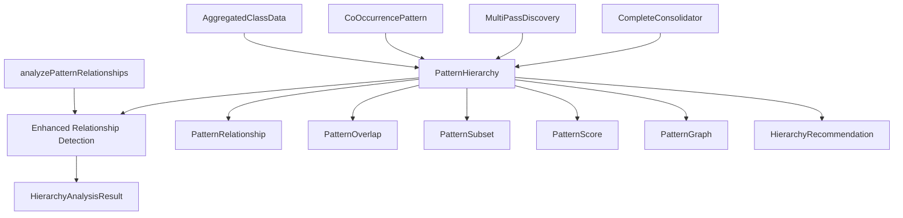

# Pattern Hierarchy Analysis System - Integration Guide

## Overview

The PatternHierarchy class provides advanced pattern relationship analysis capabilities that extend the existing pattern analysis functionality in TW-Enigma. This document describes how the new system integrates with and enhances existing code components.

## Architecture Integration

### Core Integration Points

```typescript
// packages/core/src/optimization/patternHierarchy.ts
export class PatternHierarchy {
  // Extends existing pattern analysis with advanced relationship detection
}

// Integration with existing types
import type { 
  AggregatedClassData, 
  CoOccurrencePattern 
} from '../processors/patternAnalysis';
```

### Data Flow Integration

```
Input: AggregatedClassData[] + CoOccurrencePattern[]
         ↓
PatternHierarchy.analyzeHierarchy()
         ↓
Extends: analyzePatternRelationships() from cssGeneration.ts
         ↓
Output: HierarchyAnalysisResult
```

## Integration with Existing Code

### 1. CSS Generation Engine Integration

**File**: `packages/core/src/engine/cssGeneration.ts`

**Existing Function**: `analyzePatternRelationships()` (line 2066-2200+)

**Integration Points**:
- PatternHierarchy **extends** the functionality of `analyzePatternRelationships()`
- Compatible with existing `AggregatedClassData` and relationship analysis
- Enhances relationship detection with trie structures and hierarchical analysis

**Example Integration**:
```typescript
// Existing usage
const basicRelationships = analyzePatternRelationships(classData, options);

// Enhanced usage with PatternHierarchy
const hierarchy = createPatternHierarchy();
const analysis = await hierarchy.analyzeHierarchy(classData, coOccurrencePatterns);
// analysis.relationships contains enhanced relationship data
// analysis.hierarchy contains hierarchical structure
// analysis.overlaps contains advanced overlap detection
```

### 2. Pattern Analysis Integration

**File**: `packages/core/src/processors/patternAnalysis.ts`

**Existing Types Used**:
- `AggregatedClassData` - Core data structure for pattern information
- `CoOccurrencePattern` - Co-occurrence analysis results
- `PatternFrequencyMap` - Pattern frequency mapping

**Integration Points**:
- PatternHierarchy accepts `AggregatedClassData[]` as primary input
- Uses `CoOccurrencePattern[]` for relationship strength calculation
- Maintains full compatibility with existing pattern analysis workflow

**Example Integration**:
```typescript
// Step 1: Use existing pattern analysis
const analysisResult = await generateFrequencyAnalysis(
  htmlResults, 
  jsResults, 
  options
);

// Step 2: Extract required data
const patterns = Array.from(analysisResult.frequencyMap.values());
const coOccurrences = analysisResult.coOccurrencePatterns;

// Step 3: Apply PatternHierarchy analysis
const hierarchyAnalysis = await analyzePatternHierarchy(
  patterns, 
  coOccurrences
);
```

### 3. Multi-Pass Discovery Integration

**File**: `packages/core/src/optimization/multiPassDiscovery.ts`

**Integration Point**: PatternHierarchy can be integrated into the multi-pass optimization workflow to provide evolving pattern relationship analysis.

**Example Integration**:
```typescript
export class MultiPassDiscovery {
  private patternHierarchy = createPatternHierarchy();

  async executePass(passNumber: number): Promise<PassResult> {
    // ... existing pass logic ...
    
    // Add hierarchy analysis to each pass
    const hierarchyAnalysis = await this.patternHierarchy.analyzeHierarchy(
      currentPatterns,
      currentCoOccurrences
    );
    
    // Use hierarchy recommendations for optimization decisions
    const recommendations = hierarchyAnalysis.recommendations;
    
    return {
      // ... existing results ...
      hierarchyAnalysis,
      optimizationRecommendations: recommendations
    };
  }
}
```

## Class Relationship Diagram



## API Compatibility

### Input Compatibility

The PatternHierarchy system is designed to work seamlessly with existing data structures:

```typescript
// Existing data from pattern analysis
interface AggregatedClassData {
  name: string;
  totalFrequency: number;
  htmlFrequency: number;
  jsxFrequency: number;
  sources: SourceAttribution;
  contexts: { html: any[]; jsx: any[]; };
  patterns: { prefixes: string[]; modifiers: string[]; variants: string[]; };
  coOccurrences: Map<string, number>;
  validation?: ValidationResult;
}

// Fully compatible with PatternHierarchy
const hierarchy = createPatternHierarchy();
await hierarchy.analyzeHierarchy(existingAggregatedData, existingCoOccurrences);
```

### Output Enhancement

PatternHierarchy **extends** rather than **replaces** existing functionality:

```typescript
// Before: Basic relationship analysis
const basicAnalysis = analyzePatternRelationships(classData, options);
// Returns: { relationships, clusters, recommendations }

// After: Enhanced hierarchy analysis
const enhancedAnalysis = await analyzePatternHierarchy(classData, coOccurrences);
// Returns: {
//   hierarchy: HierarchyNode[],           // NEW: Hierarchical structure
//   relationships: PatternRelationship[], // ENHANCED: More detailed relationships
//   overlaps: PatternOverlap[],           // NEW: Advanced overlap detection
//   subsets: PatternSubset[],             // NEW: Subset relationship detection
//   scores: Map<string, PatternScore>,    // NEW: Pattern scoring system
//   graph: PatternGraph,                  // NEW: Graph representation
//   recommendations: HierarchyRecommendation[], // ENHANCED: Better recommendations
//   metadata: {...}                       // NEW: Processing metadata
// }
```

## Performance Integration

### Performance Monitoring Integration

PatternHierarchy integrates with the existing performance monitoring infrastructure:

```typescript
// Uses existing performance monitoring from optimization module
import { createPerformanceMonitor } from './performanceMonitor';
import { createParallelProcessor } from './parallelProcessor';

class PatternHierarchy {
  private performanceMonitor = createPerformanceMonitor({ enabled: true });
  private parallelProcessor = createParallelProcessor(/* ... */);
  
  // All operations are monitored and can trigger performance warnings
}
```

### Scalability Integration

The system uses existing optimization infrastructure for large datasets:

```typescript
// Automatic parallel processing for large pattern sets
if (this.config.enableParallelProcessing && patterns.length > 100) {
  // Uses existing parallel processing infrastructure
  const results = await this.parallelProcessor.processInParallel(tasks);
}
```

## Configuration Integration

### Existing Configuration Compatibility

PatternHierarchy integrates with existing configuration systems:

```typescript
// Compatible with existing configuration patterns
const hierarchy = createPatternHierarchy({
  enableSubsetDetection: true,
  enableOverlapAnalysis: true,
  enablePatternScoring: true,
  minimumFrequency: 2, // Works with existing frequency filtering
  operationTimeout: 30000, // Integrates with existing timeout systems
});
```

### Configuration Extension Points

```typescript
// Extends existing PatternAnalysisOptions
interface PatternAnalysisOptionsExtended extends PatternAnalysisOptions {
  enableHierarchyAnalysis?: boolean;
  hierarchyConfig?: Partial<PatternHierarchyConfig>;
}
```

## Usage Examples

### Basic Integration

```typescript
import { 
  generateFrequencyAnalysis,
  createPatternHierarchy 
} from '@tw-enigma/core';

async function enhancedPatternAnalysis(htmlResults, jsResults, options) {
  // Step 1: Use existing pattern analysis
  const basicAnalysis = await generateFrequencyAnalysis(htmlResults, jsResults, options);
  
  // Step 2: Apply hierarchy analysis
  const patterns = Array.from(basicAnalysis.frequencyMap.values());
  const hierarchyAnalysis = await analyzePatternHierarchy(
    patterns,
    basicAnalysis.coOccurrencePatterns
  );
  
  // Step 3: Combine results
  return {
    basic: basicAnalysis,
    hierarchy: hierarchyAnalysis,
    recommendations: hierarchyAnalysis.recommendations
  };
}
```

### Multi-Pass Integration

```typescript
import { MultiPassDiscovery, createPatternHierarchy } from '@tw-enigma/core';

class EnhancedMultiPassDiscovery extends MultiPassDiscovery {
  private hierarchyAnalyzer = createPatternHierarchy();
  
  protected async analyzePatterns(patterns: AggregatedClassData[]): Promise<any> {
    // Use parent class analysis
    const basicAnalysis = await super.analyzePatterns(patterns);
    
    // Add hierarchy analysis
    const hierarchyAnalysis = await this.hierarchyAnalyzer.analyzeHierarchy(
      patterns,
      basicAnalysis.coOccurrencePatterns || []
    );
    
    return {
      ...basicAnalysis,
      hierarchy: hierarchyAnalysis
    };
  }
}
```

### CSS Generation Integration

```typescript
import { generateCSS, analyzePatternHierarchy } from '@tw-enigma/core';

async function generateOptimizedCSS(patterns: AggregatedClassData[], options: any) {
  // Step 1: Analyze pattern hierarchy
  const hierarchyAnalysis = await analyzePatternHierarchy(patterns);
  
  // Step 2: Use hierarchy recommendations for CSS generation
  const optimizedOptions = {
    ...options,
    consolidationHints: hierarchyAnalysis.recommendations
      .filter(r => r.type === 'consolidation')
      .map(r => r.patterns),
    patternScores: hierarchyAnalysis.scores
  };
  
  // Step 3: Generate CSS with enhanced information
  return generateCSS(patterns, optimizedOptions);
}
```

## Migration Guide

### For Existing Code Using `analyzePatternRelationships()`

**Before**:
```typescript
const analysis = analyzePatternRelationships(classData, options);
console.log('Relationships:', analysis.relationships.length);
```

**After** (Enhanced):
```typescript
const hierarchyAnalysis = await analyzePatternHierarchy(
  Array.isArray(classData) ? classData : [classData],
  [] // co-occurrence patterns if available
);
console.log('Relationships:', hierarchyAnalysis.relationships.length);
console.log('Hierarchy nodes:', hierarchyAnalysis.hierarchy.length);
console.log('Recommendations:', hierarchyAnalysis.recommendations.length);
```

### For Existing Pattern Analysis Workflows

**Before**:
```typescript
const result = await generateFrequencyAnalysis(htmlResults, jsResults, options);
// Use result.frequencyMap, result.coOccurrencePatterns, etc.
```

**After** (Enhanced):
```typescript
const result = await generateFrequencyAnalysis(htmlResults, jsResults, options);
const patterns = Array.from(result.frequencyMap.values());

// Add hierarchy analysis
const hierarchyAnalysis = await analyzePatternHierarchy(
  patterns,
  result.coOccurrencePatterns
);

// Use enhanced analysis
const allRecommendations = [
  ...result.patternGroups.map(g => `Group: ${g.pattern}`),
  ...hierarchyAnalysis.recommendations.map(r => r.description)
];
```

## Error Handling Integration

PatternHierarchy integrates with existing error handling patterns:

```typescript
try {
  const analysis = await analyzePatternHierarchy(patterns, coOccurrences);
} catch (error) {
  // Integrates with existing error handling infrastructure
  console.error('Pattern hierarchy analysis failed:', error.message);
  // Fallback to basic pattern analysis
  const basicAnalysis = analyzePatternRelationships(patterns, options);
}
```

## Testing Integration

The PatternHierarchy system is designed to work with existing test infrastructure:

```typescript
// Test with existing AggregatedClassData fixtures
import { mockAggregatedClassData } from '../__fixtures__/patternAnalysis';

describe('PatternHierarchy Integration', () => {
  it('should work with existing pattern data', async () => {
    const hierarchy = createPatternHierarchy();
    const analysis = await hierarchy.analyzeHierarchy(mockAggregatedClassData, []);
    
    expect(analysis.relationships).toBeDefined();
    expect(analysis.hierarchy).toBeDefined();
    expect(analysis.recommendations).toBeDefined();
  });
});
```

## Conclusion

The PatternHierarchy system is designed as a **enhancement** to existing pattern analysis functionality, maintaining full backward compatibility while providing advanced relationship analysis, hierarchy detection, and optimization recommendations. Integration requires minimal changes to existing code and provides significant value through enhanced pattern understanding and optimization opportunities.